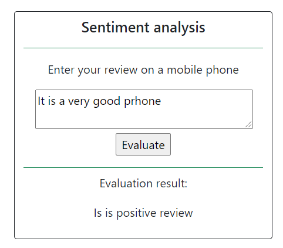

# Sentiment analysis for reviews
Application to evaluate the sentiments of reviews about mobile phones.
The application was created to learn and demonstrate the abilities of
machine learning as a final project of Coursera specialization
[Machine Learning and Data Analysis](https://www.coursera.org/specializations/machine-learning-data-analysis)

## Application features
- Parse reviews from the website
- Train the model for analysis
- Display data as the web application
- Evaluate the sentiment of review  

## How to run the application
1. Run the file train_classifier.py to train the model
2. Run the file main.py
3. Open in browser http://localhost/sentiment-analysis
4. Enter the text of the review and click Evaluate

## Used technologies
- **Requests and RegEx** to parse reviews
- **Pandas and NumPy** for data analysis
- **SGDClassifier** from **scikit-learn** to evaluate reviews
- **Joblib** to dump the model
- **Flask** to run the application on the web
- **Bootstrap** for the appearance of web page

## Files description
- data - the folder with parsed reviews
- main.py - the main script
- templates/main.html - web-page template 
- sentiment_classifier.py - review model
- parsing_reviews.py - reviews parsing
- classifier_test.py - test of work of the classifier without web
- products_sentiment_train.tsv - parsed reviews for model training
- train_classifier.py - training the classifier and saving it to a file pipeline.pkl
- pipeline.pkl - saved model (appears after training the model)